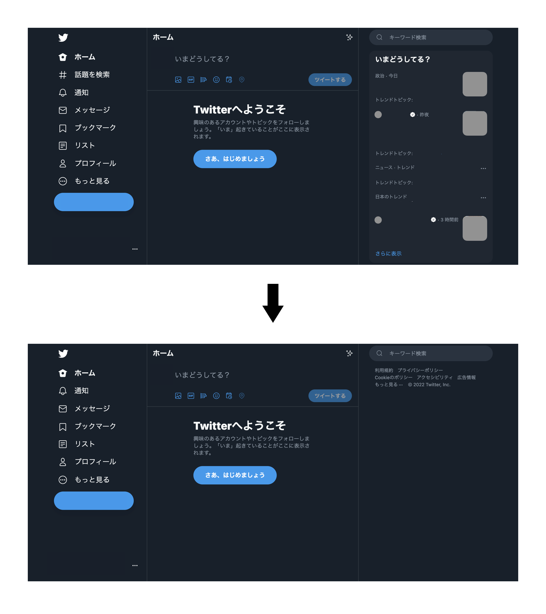

# Laggards

取り残されよう。 
追いつくのは、自分が欲したときでいい。

## Overview

Laggardsは、Twitterのトレンドに関する表示を全て非表示にすることを目的としたChrome拡張機能です。  
左ペインの「話題を検索」および右ペインの「いまどうしてる?」、「おすすめユーザー」を非表示にします。

## Usage

パッケージ化していないので、現時点では直接インストールすることはできません。  
`chrome://extensions` のページ右上にある「デベロッパー モード」を有効にし、左側の「パッケージ化されていない拡張機能を読み込む」から  
クローンしたリポジトリのディレクトリを選択してください。

## License

This repository is published under [MIT License](LICENSE).
